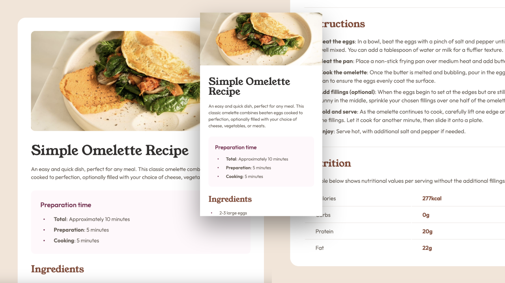

# Frontend Mentor - Recipe page solution

This is a solution to the [Recipe page challenge on Frontend Mentor](https://www.frontendmentor.io/challenges/recipe-page-KiTsR8QQKm). Frontend Mentor challenges help you improve your coding skills by building realistic projects.

## Table of contents

- [Overview](#overview)
  - [The challenge](#the-challenge)
  - [Screenshot](#screenshot)
  - [Links](#links)
- [My process](#my-process)
  - [Built with](#built-with)
  - [What I learned](#what-i-learned)
  - [Continued development](#continued-development)
  - [Useful resources](#useful-resources)
- [Author](#author)
- [Acknowledgments](#acknowledgments)

## Overview

The Recipe Page project was a fun and simple project to get my hands dirty in implementing important concepts, such as accessibility and the BEM methodology. These projects seem to always be more challenging than I thought, and I like that!

### Screenshot



### Links

- Solution URL: [Solution](https://your-solution-url.com)
- Live Site URL: [Live site](https://recipepagefementor.netlify.app/)

### Built with

- Semantic HTML5 markup
- CSS custom properties
- Flexbox
- CSS Grid
- Mobile-first workflow
- [Sass](https://sass-lang.com/) - CSS Preprocessor
- [BEM](https://getbem.com/) - CSS naming methodology
- [Web Content Accessibility Guidelines (WCAG) 2.1](https://www.w3.org/TR/WCAG21/) - Accessibility

### What I learned

- Screen reader accessibility - elaborate
- Normalize CSS - I learned that this repo has many issues, is not maintained, and has alternatives. I didn't have to do too much tweaking to the file and it worked on my end, but I'd like to get involved in the world of CSS resets and normalization.
- Prettier Ignore - I learned that you can create a file called .prettierignore and include a path to the file you'd like prettier not to format-on-save.
- noreferrer and noopener - I learned that using "rel="noreferrer noopener"" in your link tag is pretty important. Without using them, when a link is clicked, it could potentially leak information from the old page (where you clicked the link) into the new page, and can lead to JavaScript execution, leading to malicious activities and phishing attacks. Here's what ChatGPT says:

> ## noopener
>
> - Purpose: Prevents the newly opened page from having control over the page that opened it.
> - Security Benefit: This is particularly important because, without noopener, the new page
>   (the page you link to) can potentially access the window.opener property and execute JavaScript
>   in the opening page's context. This can lead to malicious activities, such as phishing attacks,
>   where the original page is replaced with a fake one to steal information.
> - Performance Benefit: Using noopener also improves performance for the page that opened the
>   link. Without it, the new page shares the same process as the opener page, which could affect the
>   performance of the original page.
>
> ## noreferrer
>
> - Purpose: Prevents the browser from sending the HTTP Referer header to the linked page.
> - Privacy Benefit: This hides the referrer information (the page the user came from) from the
>   destination page, which can be particularly useful for privacy reasons, ensuring that the
>   destination site does not know where the traffic originated from.
> - Security Benefit: Similar to noopener, noreferrer also implies noopener behavior in modern
>   browsers, providing the same security benefits by not allowing the new page to have control over
>   the originating page.
> - Compatibility Note: Before noopener was widely supported, noreferrer was often used to achieve
>   similar security benefits. Now, noopener is supported in most modern browsers, but noreferrer is
>   still useful for older browsers and for situations where you want to hide referrer information.
>
> ## Using Both
>
> While noopener alone can protect against the security vulnerabilities mentioned and is widely
> supported in modern browsers, adding noreferrer as well ensures broader compatibility with older
> browsers and also addresses privacy concerns by not leaking referrer information. Thus, using
> rel="noreferrer noopener" together in links to external sites that open in a new tab/window (target="\_blank")
> is a good practice for enhancing both security and privacy.

- Heading tags have a prebuilt margin on the top and bottom. This is to ensure a clear and visible hierarchy for readability and accessibility. While working closely with the design file and setting consistent padding around the elements, this got tricky. However, you can reset the heading tags to include no margin as long as the hierarchy is still visible, which can be done using padding.

- I learned how to override the bullet styles of a list item.

### HTML

```html
<ul class="custom-bullets">
  <li>
    <span class="label">Total</span
    ><span class="value">: Approximately 10 minutes</span>
  </li>
  <li>
    <span class="label">Preparation</span><span class="value">: 5 minutes</span>
  </li>
  <li>
    <span class="label">Cooking</span><span class="value">: 5 minutes</span>
  </li>
</ul>
```

### CSS

```css
ul.custom-bullets {
  list-style-type: none;
  padding-left: 0;
}

ul.custom-bullets li {
  position: relative;
  padding-left: 40px;
}

ul.custom-bullets li::before {
  content: '•';
  position: absolute;
  top: 50%;
  left: 8px;
  font-size: 13px;
  color: #7a284e;
  transform: translateY(-50%);
}
```

- Inheretance - This is a deep subject! But it's also familiarized me more with the dev tools. My first run in was when styling some bullet points from two unordered lists. The first list was in a container while the second was not. When setting the font-size to the :after pseudo selector, both lists' bullet styles behaved differently. Upon examining the dev tools, each list was showing me what CSS properties were inherited. Very eye-opening. My solution was to implement a default font-style to the body element, which did the trick! Also, while refactoring my Sass code to comply with BEM standards, I had to remove a lot of my nesting, as it goes against said standards. I ran into a few instances where I had to inspect where styles were getting inherited from. Another example being on a top margin that wasn't budging. The element was a list item in an unordered list (again!), and being as I have two unordered lists, selecting that list element as a first child proved to be daunting. I attempted to select the first unordered list via the first child pseudo selector and applying a red background color to it, but I just couldn't get it. I will try to be more cognizant of this in the future. My workaround was to select the small heading (and there was, thankfully, only one!) and give it a negative margin on the bottom. Kind of hacky, I know, but it worked!

- Just like overriding the bullet styles from an unordered list above, I learned how to manipulate the numbers in an ordered list. It was a bit trickier, but adding a container div within my list item helped.

```html
<ol>
  <li>
    <div class="container">
      <span class="label">Beat the eggs</span
      ><span class="value"
        >: In a bowl, beat the eggs with a pinch of salt and pepper until they
        are well mixed. You can add a tablespoon of water or milk for a fluffier
        texture.</span
      >
    </div>
  </li>
  <li>
    <div class="container">
      <span class="label">Heat the pan</span
      ><span class="value"
        >: Place a non-stick frying pan over medium heat and add butter or
        oil.</span
      >
    </div>
  </li>
  <li>
    <div class="container">
      <span class="label">Cook the omelette</span
      ><span class="value"
        >: Once the butter is melted and bubbling, pour in the eggs. Tilt the
        pan to ensure the eggs evenly coat the surface.</span
      >
    </div>
  </li>
  <li>
    <div class="container">
      <span class="label">Add fillings (optional)</span
      ><span class="value"
        >: When the eggs begin to set at the edges but are still slightly runny
        in the middle, sprinkle your chosen fillings over one half of the
        omelette.</span
      >
    </div>
  </li>
  <li>
    <div class="container">
      <span class="label">Fold and serve</span
      ><span class="value"
        >: As the omelette continues to cook, carefully lift one edge and fold
        it over the fillings. Let it cook for another minute, then slide it onto
        a plate.</span
      >
    </div>
  </li>
  <li>
    <div class="container">
      <span class="label">Enjoy</span
      ><span class="value"
        >: Serve hot, with additional salt and pepper if needed.</span
      >
    </div>
  </li>
</ol>
```

### CSS

```css
ol {
  list-style-position: outside;
  margin-left: -16px;
}

ol li::marker {
  color: #854632;
  font-size: 16px;
  font-weight: 600;
}

ol li .container {
  width: 272px;
  margin-left: 18px;
}
```

- I learned that you CANNOT place a horizontal rule `<hr>` inside of a table where the data goes. It will render it outside of the actual table no matter where you place it.

- I learned about map-get in Sass. This is an awesome way to clean up your variables!

### Sass

```
// Font Weights
$font-weights: (light: 300, normal: 400, semi-bold: 500, bold: 600, heavy: 700)

%outfit
    font-family: "Outfit", sans-serif
    font-optical-sizing: auto
    font-weight: map-get($font-weights, light)
    font-style: normal
    line-height: map-get($line-heights, body)
    color: map-get($colors, body-primary)
```

- I learned that in a table, thead and tbody tags are necessary for accessibility purposes. The design file does not include headers to scope the columns, so I hid them via css

### HTML

```html
<table class="recipe__table">
  <thead>
    <tr>
      <th class="recipe__visually-hidden" scope="col">Nutrient</th>
      <th class="recipe__visually-hidden" scope="col">Amount</th>
    </tr>
  </thead>
  <tbody>
    <tr class="recipe__table_row">
      <td class="recipe__table-label">Calories</td>
      <td class="recipe__table-value">277kcal</td>
    </tr>
    <tr class="recipe__table_row">
      <td class="recipe__table-label">Carbs</td>
      <td class="recipe__table-value">0g</td>
    </tr>
    <tr class="recipe__table_row">
      <td class="recipe__table-label">Protein</td>
      <td class="recipe__table-value">20g</td>
    </tr>
    <tr class="recipe__table_row">
      <td class="recipe__table-label">Fat</td>
      <td class="recipe__table-value">22g</td>
    </tr>
  </tbody>
</table>
```

### Sass

```scss
.recipe {
  &__visually-hidden
    position: absolute
    width: 1px
    height: 1px
    margin: -1px
    padding: 0
    overflow: hidden
    clip: rect(0, 0, 0, 0)
    border: 0
}
```

- I also learned that markdown won't read sass and you have to modify it to scss

### Continued development

I'm definitely loving Sass and the BEM methodology. I feel like it can provide great structure to the code. This was a fairly simple project to incorporate accessibility options to, but I will continue my learning of all of the above mentioned.

### Useful resources

- [Web Content Accessibility Guidelines (WCAG) 2.1](https://www.w3.org/TR/WCAG21/) - This guide is helping me to better understand how to make the content of my web sites accessible to as many users as possible, including those with disabilities such as "blindness and low vision, deafness and hearing loss, limited movement, speech disabilities, photosensitivity, and combinations of these, and some accommodation for learning disabilities and cognitive limitations."[^1]
- [Sass](https://sass-lang.com/) - While I've used Sass in the past, their documentation helped me get a better understanding of this CSS preprocessor tool.
- [BEM](https://getbem.com/) - This guide helped me adopt the methodology and naming convention for organizing CSS code to make it more readable, scalable, and easier to maintain.
- [Normalize CSS](https://necolas.github.io/normalize.css/) - This seems to be the most comprehennsive CSS reset (but not actually a reset) that I've found so far. I haven't compared it line-by-line with Eric Meyer's CSS Reset as of yet, but it is in my plans. I'm also reading in the about section that it doesn't reset every element, instead it "retains many useful default browser styles[^2]." I do notice, however, that this post is written in 2012, so I may have to dig deeper into some research. While browsing Normalize css's [GirHub](https://github.com/necolas/normalize.css), I came across an interesting [issue](https://github.com/necolas/normalize.css/issues/880) that shows that the project may no longer be maintained. There are some alternatives by the community that I may look into. [This one](https://github.com/u1ui/norm.css) has tons of listed resources.

[^1]: Source: [Web Content Accessibility Guidelines (WCAG) 2.1](https://www.w3.org/TR/2023/REC-WCAG21-20230921/#abstract)
[^2]: Source [About normalize.css](https://nicolasgallagher.com/about-normalize-css/)

## Author

- Website - [Steve Xero](https://www.stevexero.com) - under construction
- Old [Website](https://www.steven-woodward.com)
- GitHub - [Steve Xero](https://www.github.com/stevexero)
- Frontend Mentor - [@stevexero](https://www.frontendmentor.io/profile/stevexero)
- X - [@steve_xero](https://www.twitter.com/steve_xero)

## Acknowledgments

I'd like to give a shoutout to [Shashi Lo](https://github.com/shashilo) [X](https://www.twitter.com/shashiwhocodes) for hosting the [Gridiron Survivor Project](https://www.youtube.com/watch?v=JfLfIKMgnDQ&list=PLxiHOcgq5czRYfmc-bO_aABECrtBE3YR3) as well as [Corina Murg](https://github.com/CorinaMurg) [LinkedIn](https://www.linkedin.com/in/corinamurg/) for diving deep into accessibility right when I became very interested in it! I'd also like to give a shoutout to [Ryan Furrer](https://twitter.com/ryandotfurrer) for answering my question about Prettier and team config files!
